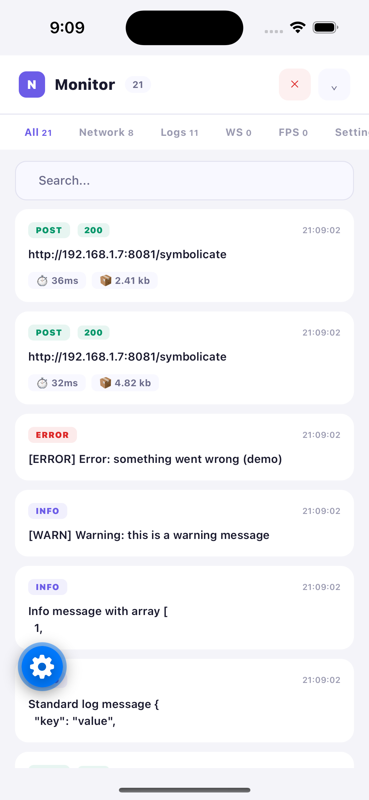
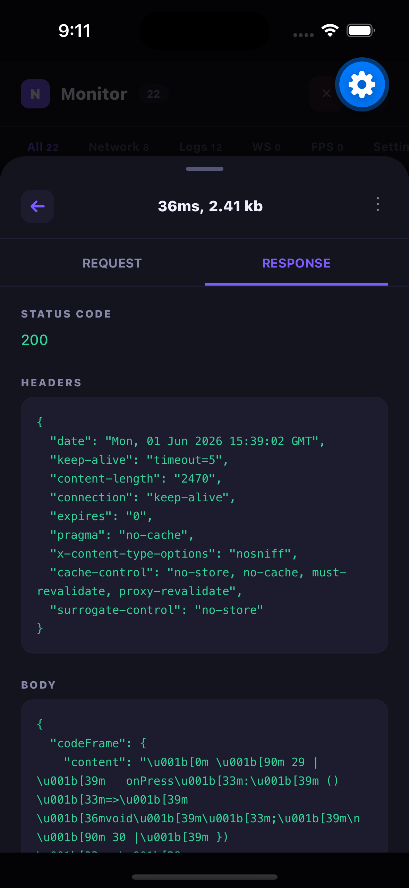
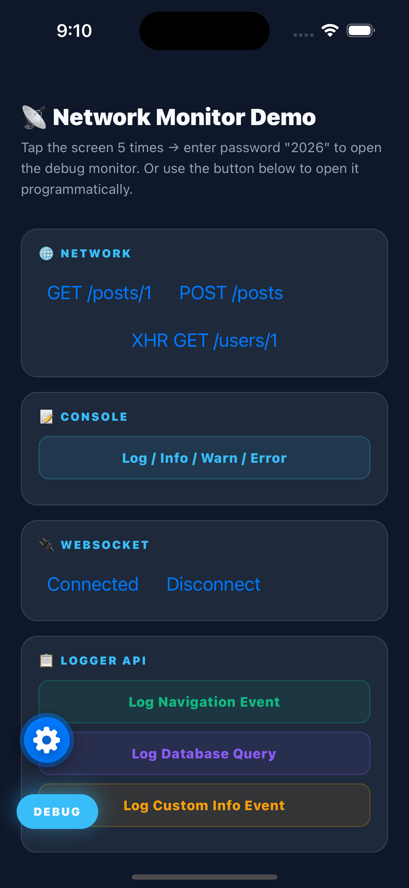
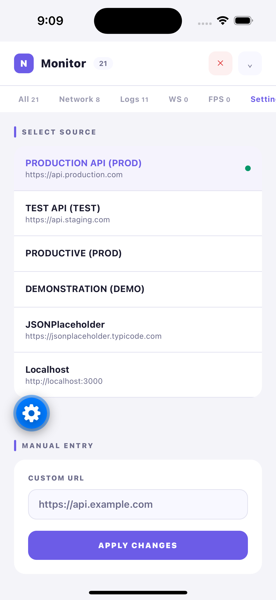

# React Native Network Monitor

A polished in-app debug monitor for React Native apps.

Use it to capture network traffic, console logs, WebSocket messages, FPS performance, errors, and more — all without leaving your app.

<p align="center">
  
  
  
  
</p>

[](https://www.npmjs.com/package/@mspvirajpatel/react-native-network-monitor)
[](https://opensource.org/licenses/MIT)
[](https://www.typescriptlang.org/)
[](https://github.com/mspvirajpatel/react-native-network-monitor/actions/workflows/release.yml)
[](https://www.npmjs.com/package/@mspvirajpatel/react-native-network-monitor)

## Why this package

- Capture `fetch` + `XMLHttpRequest` + `WebSocket` traffic automatically
- Visualize request/response details in-app
- See `console.log`, `console.warn`, and `console.error` output
- Monitor real-time FPS performance with history chart
- Catch React render errors and unhandled promise rejections
- Protect access with a password trigger
- Switch API endpoints in seconds
- Export logs to JSON or text reports, save to device filesystem
- Persist logs across app restarts
- Open the debugger programmatically from anywhere in your app

## Features

- 🔍 Network interception for `fetch`, XHR, and WebSocket
- 📝 Console log capture
- 🔐 Password-protected access with optional skip
- 🌐 Environment / base URL switching
- 📊 Rich debug UI with search and filters
- 🌗 Light/dark theme support
- 📤 Export logs as JSON or formatted text report
- 💾 Save reports to device filesystem (expo-file-system / react-native-fs)
- 🧠 Log persistence across app restarts
- 🔌 WebSocket monitoring (open/close/message/error)
- ⚡ FPS performance monitor with live stats and history chart
- 🛡️ Error Boundary + global JS error / promise rejection capture
- 📱 Device info panel (platform, OS, model, screen, app version)
- 🚀 Programmatic open/close via `useDebugger()` hook
- 🧩 Custom storage adapter support
- 🌍 Multilanguage UI with English, Russian, Turkish, Azerbaijani
- 🔘 Draggable floating DEBUG button with auto-hide
- 📐 Safe area aware — respects device notch, rounded corners, home indicator
- ↔️ Configurable screen edge margin for floating button

---

## Install

```bash
npm install @mspvirajpatel/react-native-network-monitor react-native-safe-area-context
```

```bash
yarn add @mspvirajpatel/react-native-network-monitor react-native-safe-area-context
```

Optional export dependencies:

```bash
npm install expo-file-system expo-sharing
# or
npm install react-native-fs
```

---

## Quick Start

Wrap your app with `DebugTrigger`:

```tsx
import React from 'react';
import { DebugTrigger } from '@mspvirajpatel/react-native-network-monitor';

export default function App() {
  return (
    <DebugTrigger
      password="2026"
      passwordFrequency="all-time"
      clicksNeeded={5}
      prodUrl="https://api.production.com"
      testUrl="https://api.staging.com"
    >
      {/* Your app content */}
    </DebugTrigger>
  );
}
```

Tap the screen 5 times, enter the password, and the debug monitor opens.

---

## Primary API

### `DebugTrigger`

Use `DebugTrigger` to wrap your app and enable the debug monitor.

```tsx
import { DebugTrigger } from '@mspvirajpatel/react-native-network-monitor';
```

### `useDebugger`

Use inside any component rendered within `<DebugTrigger>`.

```tsx
import { useDebugger } from '@mspvirajpatel/react-native-network-monitor';
```

### Performance helpers

```tsx
import {
  startPerformanceMonitor,
  stopPerformanceMonitor,
  subscribeToFps,
  isPerformanceMonitorRunning,
} from '@mspvirajpatel/react-native-network-monitor';
```

---

## Key Props

| Prop | Type | Description |
|---|---|---|
| `password` | `string` | Password required to open the debugger |
| `passwordFrequency` | `'all-time' | 'per-install' | 'app-active'` | How often the password is requested |
| `passwordOptional` | `boolean` | Skip the password modal while keeping a password configured |
| `enableTapGesture` | `boolean` | Enable or disable the 5-tap open gesture |
| `clicksNeeded` | `number` | Number of taps required to open the debugger |
| `prodUrl` | `string` | Production base URL entry |
| `testUrl` | `string` | Test base URL entry |
| `baseUrls` | `string[]` or `{ title: string; url: string }[]` | Custom list of saved base URLs |
| `onBaseUrlChange` | `(newUrl: string) => void` | Called when the user selects a new base URL |
| `onEnvChange` | `(newEnv: 'demo' | 'prod') => void` | Called when demo/prod mode changes |
| `enabled` | `boolean` | Enable or disable the monitor |
| `isDemo` | `boolean` | Enable demo mode |
| `floatingButtonMargin` | `number` | Extra screen edge padding for the floating button |
| `checkAccess` | `() => boolean | Promise<boolean>` | Custom guard for opening the debugger |
| `language` | `'az' | 'en' | 'ru' | 'tr' | 'auto'` | UI language selection |
| `theme` | `'light' | 'dark' | 'auto'` | Force light/dark mode or follow system |

---

## Examples

### Environment Switching

```tsx
<DebugTrigger
  prodUrl="https://api.production.com"
  testUrl="https://api.qa.com"
  baseUrls={[
    { title: 'Local', url: 'http://localhost:3000' },
    { title: 'QA', url: 'https://api.qa.com' },
  ]}
  onBaseUrlChange={(url) => console.log('Switched to', url)}
>
  <App />
</DebugTrigger>
```

### Open Programmatically

```tsx
import { useDebugger } from '@mspvirajpatel/react-native-network-monitor';

function Settings() {
  const { openDebugger, closeDebugger, isDebuggerOpen } = useDebugger();

  return (
    <View>
      <Button title="Open Debugger" onPress={openDebugger} />
      <Text>Debugger is {isDebuggerOpen ? 'open' : 'closed'}</Text>
    </View>
  );
}
```

### Optional Quick Access

```tsx
<DebugTrigger
  password="2026"
  passwordOptional
  enableTapGesture={true}
>
  <App />
</DebugTrigger>
```

### Disable Tap Gesture

```tsx
<DebugTrigger
  password="2026"
  enableTapGesture={false}
>
  <App />
</DebugTrigger>
```

The debugger remains available through `useDebugger()` only.

---

## FPS Monitor

```tsx
import {
  startPerformanceMonitor,
  stopPerformanceMonitor,
  subscribeToFps,
  isPerformanceMonitorRunning,
} from '@mspvirajpatel/react-native-network-monitor';

startPerformanceMonitor();
stopPerformanceMonitor();
const running = isPerformanceMonitorRunning();

subscribeToFps((stats) => {
  console.log(stats);
});
```

---

## Notes

- Requires `react-native-safe-area-context`
- Supports React Native `>=0.60.0`
- Works with Expo when optional export dependencies are installed

---

## License

MIT
