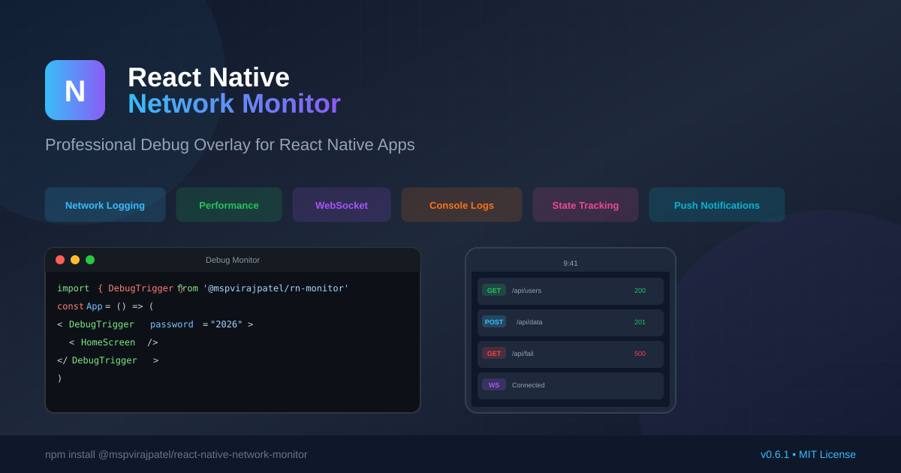

# React Native Network Monitor

<div align="center">



[](https://www.npmjs.com/package/@mspvirajpatel/react-native-network-monitor)
[](https://www.npmjs.com/package/@mspvirajpatel/react-native-network-monitor)
[](https://opensource.org/licenses/MIT)
[](https://www.typescriptlang.org/)
[](https://reactnative.dev/)

**Professional Debug Overlay for React Native Apps**

🚀 [Demo](#demo) • 📦 [Installation](#installation) • 📖 [Documentation](#documentation) • 🤝 [Contributing](#contributing)

</div>

---

## ✨ Features

| Feature | Description |
|---------|-------------|
| 🌐 **Network Monitoring** | Automatic interception of fetch & XMLHttpRequest with request/response details |
| 📊 **Performance Tracking** | Real-time FPS monitoring, memory usage, and historical charts |
| 🔌 **WebSocket Logging** | Track WebSocket connections, messages, and errors |
| 📝 **Console Capture** | Capture console.log, warn, error, and info messages |
| 💾 **State Tracking** | Redux & Zustand middleware for state change visualization |
| 📲 **Push Notifications** | Log and inspect push notification payloads |
| 🧭 **Navigation Flow** | Visualize screen transitions with timing and deep links |
| 🔍 **Advanced Filtering** | Filter by method, status, domain, time range, and regex |
| 📤 **Export Capabilities** | JSON, text reports, and HAR file export |
| 🔐 **Security** | Password protection, tap-count authentication, and shake gestures |
| 🌍 **i18n** | 13 languages with RTL support |
| 🎨 **Theming** | Dark/Light modes with custom color support |

---

## 📦 Installation

```bash
npm install @mspvirajpatel/react-native-network-monitor
# or
yarn add @mspvirajpatel/react-native-network-monitor
```

---

## 🚀 Quick Start

### 1. Wrap Your App

```jsx
import { DebugTrigger } from '@mspvirajpatel/react-native-network-monitor';

export default function App() {
  return (
    <DebugTrigger password="2026">
      <YourApp />
    </DebugTrigger>
  );
}
```

### 2. Open the Debugger

- **Tap** the floating DEBUG button 5 times
- **Enter** password (default: `2026`)
- **Done!** 🎉

---

## 📱 Demo

<div align="center">


*Real-time network monitoring with advanced filtering*

</div>

---

## ⚙️ Configuration

### Basic Props

```jsx
<DebugTrigger
  password="2026"           // Password for authentication
  clicksNeeded={5}          // Taps needed to open
  enableShake={true}        // Enable shake gesture
  theme="dark"              // 'light' | 'dark' | 'auto'
  language="en"             // Language code
>
  <YourApp />
</DebugTrigger>
```

### Feature Flags

```jsx
<DebugTrigger
  features={{
    network: true,          // Network monitoring
    console: true,          // Console capture
    websocket: true,        // WebSocket logging
    performance: true,      // FPS tracking
    memory: true,           // Memory monitoring
    notifications: true,    // Push notification logging
    navigationFlow: true,   // Navigation tracking
    errorBoundary: true,    // Error boundary
    persistence: true,      // Log persistence
  }}
>
  <YourApp />
</DebugTrigger>
```

### Custom Theme

```jsx
<DebugTrigger
  theme="dark"
  colors={{
    primary: '#38BDF8',
    secondary: '#22C55E',
    success: '#10B981',
    accent: '#8B5CF6',
  }}
>
  <YourApp />
</DebugTrigger>
```

---

## 🔧 Advanced Usage

### Programmatic Control

```jsx
import { useDebugger } from '@mspvirajpatel/react-native-network-monitor';

function MyComponent() {
  const { openDebugger, closeDebugger, isDebuggerOpen } = useDebugger();
  
  return (
    <Button 
      title="Open Debug" 
      onPress={openDebugger} 
    />
  );
}
```

### State Tracking (Redux)

```jsx
import { createReduxMiddleware } from '@mspvirajpatel/react-native-network-monitor';

const store = createStore(rootReducer, applyMiddleware(
  createReduxMiddleware({ storeName: 'MyStore' })
));
```

### State Tracking (Zustand)

```jsx
import { createZustandMonitor } from '@mspvirajpatel/react-native-network-monitor';

const useStore = create(
  createZustandMonitor(
    (set) => ({ count: 0, increment: () => set((state) => ({ count: state.count + 1 })) }),
    { storeName: 'Counter' }
  )
);
```

### Manual Notification Logging

```jsx
import { logNotification } from '@mspvirajpatel/react-native-network-monitor';

// In your notification handler
logNotification({
  title: 'New Message',
  body: 'You have a new message',
  data: { screen: 'Chat', id: 123 },
  source: 'remote',
});
```

### Navigation Tracking

```jsx
import { logNavigationEvent } from '@mspvirajpatel/react-native-network-monitor';

// In your navigation listener
logNavigationEvent({
  screen: 'Profile',
  method: 'push',
  params: { userId: 123 },
  deepLink: 'myapp://profile/123',
});
```

---

## 📊 Tabs Overview

| Tab | Description |
|-----|-------------|
| **All** | Combined view of all logs |
| **Network** | HTTP requests and responses |
| **Console** | Console.log, warn, error messages |
| **WS** | WebSocket events |
| **FPS** | Performance monitoring |
| **Memory** | Heap usage tracking |
| **Store** | State changes (Redux/Zustand) |
| **Notifs** | Push notification logs |
| **Flow** | Navigation flow visualization |
| **Settings** | Configuration and export |

---

## 🛠️ Development

```bash
# Clone the repository
git clone https://github.com/mspvirajpatel/react-native-network-monitor.git

# Install dependencies
cd packages/network-monitor
npm install

# Build the package
npm run build

# Type check
npm run typescript

# Lint
npm run lint
```

---

## 📝 Export Features

### JSON Report
```jsx
import { generateExportReport } from '@mspvirajpatel/react-native-network-monitor';

const report = generateExportReport();
```

### HAR Export
```jsx
import { saveReportToFile } from '@mspvirajpatel/react-native-network-monitor';

await saveReportToFile('network.har');
```

### Share Report
```jsx
import { formatReportAsText } from '@mspvirajpatel/react-native-network-monitor';

const text = formatReportAsText();
await Share.share({ message: text });
```

---

## 🌍 Supported Languages

English, Spanish, French, German, Portuguese, Italian, Japanese, Korean, Chinese (Simplified), Chinese (Traditional), Arabic, Russian, Turkish, Hindi, Gujarati, Azerbaijani

---

## 🤝 Contributing

Contributions are welcome! Please read our [Contributing Guide](CONTRIBUTING.md) before submitting a PR.

### Development Setup

1. Fork the repository
2. Create your feature branch (`git checkout -b feature/amazing-feature`)
3. Commit your changes (`git commit -m 'Add amazing feature'`)
4. Push to the branch (`git push origin feature/amazing-feature`)
5. Open a Pull Request

---

## 📄 License

This project is licensed under the MIT License - see the [LICENSE](LICENSE) file for details.

---

## 🙏 Support

If this project helps you, please consider giving it a ⭐ on GitHub!

[](https://github.com/mspvirajpatel/react-native-network-monitor)

---

## 📞 Contact

- **Author:** Viraj Patel
- **GitHub:** [mspvirajpatel](https://github.com/mspvirajpatel)

---

<div align="center">

**Made with ❤️ for the React Native community**

</div>